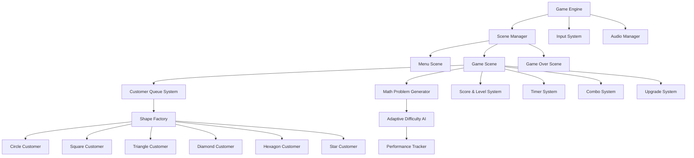
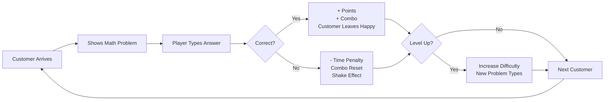

# 🎮 MathDesk — Game Design Document

## 1. Game Overview

**Title:** MathDesk  
**Genre:** Casual / Puzzle / Math  
**Platform:** Web (HTML5 / JavaScript)  
**Target Audience:** Ages 8+, casual gamers, math enthusiasts  
**Development Scope:** Solo developer  

> [!NOTE]
> MathDesk is a minimalist math game where geometric shape "customers" visit the player's office desk seeking help with math equations. The player types answers to progress through increasingly difficult levels.

---

## 2. Game Architecture



### Module Breakdown

| Module | Responsibility |
|--------|---------------|
| **GameEngine** | Main loop, state management, initialization |
| **SceneManager** | Switching between menu, gameplay, game-over |
| **InputSystem** | Keyboard capture, answer validation |
| **CustomerQueue** | Managing queue of shape customers |
| **MathGenerator** | Creating problems based on level + AI |
| **ScoreSystem** | Points, multipliers, high scores |
| **LevelSystem** | Progression, difficulty curves |
| **TimerSystem** | Per-customer timer, pressure mechanic |
| **ComboSystem** | Streak tracking, bonus multipliers |
| **AdaptiveDifficulty** | AI-driven difficulty adjustment |
| **AudioManager** | Sound effects for correct/wrong/levelup |
| **UpgradeSystem** | Hints, slow-time, score boosts |

---

## 3. Core Gameplay Loop



### Loop Details

1. **Customer arrives** at desk with bounce animation
2. **Math problem** appears on the "computer screen" UI
3. **Player types** answer using keyboard → input field
4. **Submit** with Enter key
5. **Feedback**: correct (green flash, +score, customer slides away happy) or incorrect (red shake, time penalty, combo reset)
6. **Next customer** approaches from the queue
7. **Level up** every 5 correct answers → harder problems, faster timer

---

## 4. AI Difficulty System

### Adaptive Difficulty Algorithm

```
Performance Score = (correct_answers / total_answers) × 100

IF performance > 85% for last 10 questions:
    → Increase difficulty tier by 1
    → Reduce timer by 1 second
    
IF performance < 50% for last 10 questions:
    → Decrease difficulty tier by 1
    → Add 2 seconds to timer

IF combo_streak > 5:
    → Temporarily boost difficulty for bonus points
```

### Problem Generation by Level

| Level | Operations | Number Range | Example |
|-------|-----------|-------------|---------|
| 1-3 | +, − | 1–20 | `7 + 5 = ?` |
| 4-6 | ×, ÷ | 1–12 | `8 × 6 = ?` |
| 7-9 | Mixed ops | 1–50 | `15 + 8 × 3 = ?` |
| 10-12 | Parentheses | 1–100 | `(12 + 8) × 3 = ?` |
| 13+ | Variables | Simple algebra | `3x + 5 = 20, x = ?` |

---

## 5. Visual Design & UI Wireframe

### Screen Layout

```
┌─────────────────────────────────────────────────┐
│  🏆 Score: 1250    ⚡ Combo: x3    📊 Lvl: 5   │
│─────────────────────────────────────────────────│
│                                                  │
│   [Queue: △ □ ◇]     ┌──────────────────────┐  │
│                       │                      │  │
│       ● ← Current    │   8 × 6 = ?          │  │
│     (eyes blink)     │                      │  │
│                       │   Answer: [____]     │  │
│   ════════════════   │                      │  │
│   ▓▓▓▓▓▓▓░░░ Timer  │                      │  │
│                       └──────────────────────┘  │
│                                                  │
│   ┌─────────────────────────────────────────┐   │
│   │  🪵 DESK SURFACE                        │   │
│   └─────────────────────────────────────────┘   │
│                                                  │
│  [💡 Hint]  [⏸ Pause]  [⏱ Slow Time]          │
│─────────────────────────────────────────────────│
│  ⭐ Best: 5200      🔥 Streak: 8               │
└─────────────────────────────────────────────────┘
```

### Shape Customer Designs

| Shape | Color | Personality | Animation |
|-------|-------|-------------|-----------|
| Circle | Coral (#FF6B6B) | Friendly, patient | Gentle bounce |
| Square | Sky Blue (#4ECDC4) | Serious, precise | Slight rotation |
| Triangle | Amber (#FFE66D) | Energetic, fast | Quick wobble |
| Diamond | Purple (#A855F7) | Mysterious | Slow spin |
| Hexagon | Emerald (#10B981) | Wise, calm | Subtle pulse |
| Star | Gold (#F59E0B) | Enthusiastic | Sparkle effect |

---

## 6. Scoring & Progression

### Point System

| Action | Points |
|--------|--------|
| Correct answer | 100 × level |
| Combo bonus (per streak) | +25 per consecutive |
| Speed bonus (< 3 sec) | +50 |
| Perfect level (no mistakes) | +500 |
| Wrong answer | −25 |

### Combo Multiplier

| Streak | Multiplier |
|--------|-----------|
| 0-2 | ×1 |
| 3-4 | ×1.5 |
| 5-7 | ×2 |
| 8-10 | ×3 |
| 11+ | ×5 |

---

## 7. Upgrade System

| Upgrade | Cost | Effect |
|---------|------|--------|
| 💡 Hint | 500 pts | Shows first digit of answer |
| ⏱ Slow Time | 750 pts | +5 seconds on next timer |
| ×2 Score | 1000 pts | Double points for 3 questions |
| 🛡 Shield | 1500 pts | Blocks 1 wrong answer penalty |

---

## 8. Technical Implementation

### File Structure

```
game/
├── index.html          # Main HTML structure
├── css/
│   └── style.css       # All styling
├── js/
│   ├── main.js         # Entry point, game loop
│   ├── engine.js       # Core game engine
│   ├── scenes.js       # Scene management
│   ├── math-gen.js     # Math problem generator + AI
│   ├── customers.js    # Shape customer system
│   ├── score.js        # Score & combo system
│   ├── timer.js        # Timer mechanics
│   ├── upgrades.js     # Upgrade shop
│   ├── audio.js        # Sound manager
│   └── particles.js    # Visual effects
├── assets/
│   └── sounds/         # Sound effects (generated)
└── README.md
```

---

## 9. Monetization Suggestions (Optional)

| Strategy | Implementation |
|----------|---------------|
| **Ad-supported** | Interstitial ads between levels |
| **Premium version** | Remove ads, unlock all upgrades |
| **Daily challenges** | Leaderboard with ad-gated retries |
| **Cosmetic shapes** | Unlock rare customer shapes |

> [!TIP]
> For a solo developer, the simplest monetization is ad-supported free + premium ad-free version at $1.99.

---

## 10. Development Phases

### Phase 1 — Core (Week 1-2)
- [x] Game engine & scene management
- [x] Math problem generator
- [x] Input system
- [x] Basic scoring

### Phase 2 — Polish (Week 3)
- [x] Shape customers with animations
- [x] Combo system
- [x] Timer mechanic
- [x] Adaptive difficulty

### Phase 3 — Features (Week 4)
- [x] Upgrade system
- [x] Sound effects
- [x] Particle effects
- [x] High score persistence

### Phase 4 — Launch
- [ ] Cross-browser testing
- [ ] Mobile responsive
- [ ] Performance optimization
- [ ] Deploy to hosting
